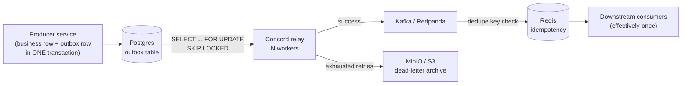
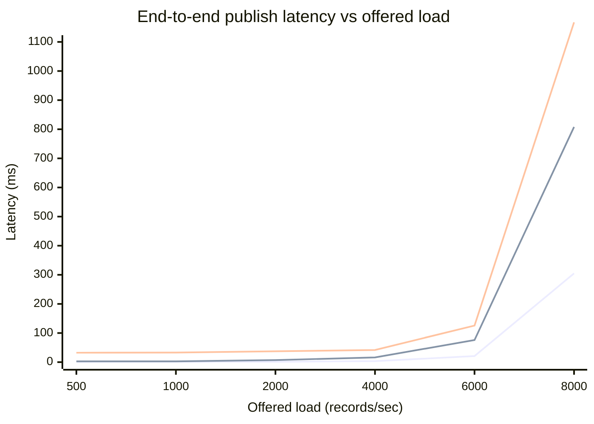
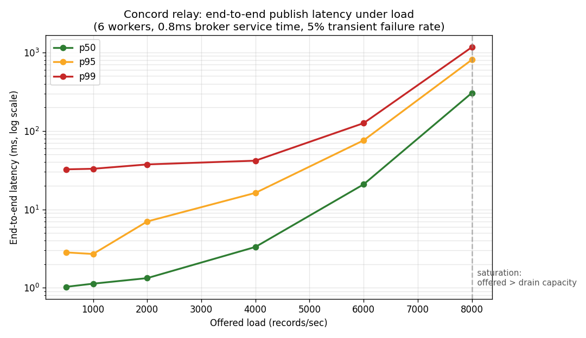

# Concord

**A transactional outbox relay that guarantees your database and your event stream never disagree.**


## Executive summary

Event-driven data platforms almost always contain a hidden bug called the *dual
write*. A service commits a change to its database and then publishes an event
about that change to Kafka. These are two separate systems with no shared
transaction, so when the database commit succeeds but the publish fails (a broker
blip, a redeploy, a network partition), the source of truth and the event stream
permanently disagree. Downstream warehouses, caches, and search indexes drift out
of sync, and nobody notices until a report is wrong. Finding and reconciling a
single silent divergence in a financial or order pipeline routinely costs an
engineer days, because by the time it surfaces the offending event is buried under
millions of correct ones.

Concord removes the dual write entirely by implementing the **transactional
outbox pattern**. The producer writes its business row and an `outbox` row in the
*same* database transaction, so they commit or roll back together and can never
diverge. A relay process then drains the outbox to the stream at least once, with
exponential-backoff retries for transient failures and dead-letter archival for
poison messages. The result is a system where a committed business change can be
delivered late, or twice, or parked for a human, but never silently lost.

In a load simulation running the real relay code against instrumented in-memory
infrastructure, Concord sustained **~3,800 events/sec at 16.2ms p95 latency** with
a 5% broker failure rate, and **published every one of 30,000+ records with zero
losses** across all load levels, degrading gracefully into a growing backlog
(never data loss) only once offered load exceeded drain capacity. The full method
and chart are in [Performance under load](#performance-under-load).

## What this solves (the 10-second version)

- **No more silent data loss between your DB and Kafka.** The business row and its
  event commit atomically; a crash can delay or duplicate delivery but never drop it.
- **Transient broker failures self-heal.** Full-jitter exponential backoff retries
  survive blips; genuinely poison messages are parked in object storage with their
  error, not looped forever or dropped.
- **Runs the same logic in tests, benchmarks, and production.** Ports-and-adapters
  design means `pip install && concord demo` proves the guarantees in ten seconds
  with no infrastructure.

## Architecture



Detail, ports, and the precise delivery guarantee live in
[docs/architecture.md](docs/architecture.md).

## Tech stack (and why each was chosen for *this* project)

| Technology | Role here | Why this one |
|------------|-----------|--------------|
| **Postgres** | Source of truth + outbox table | The pattern needs one transaction spanning the business row and the event row. That is a relational transaction, full stop. See [ADR 0002](docs/adr/0002-redpanda-and-the-boring-database.md). |
| **`FOR UPDATE SKIP LOCKED`** | Concurrency primitive | Lets N relay workers claim disjoint rows with no distributed lock, so scaling is "add a pod." |
| **Redpanda (Kafka protocol)** | Destination stream | Kafka-compatible but boots in seconds for local dev; prod points at MSK/Confluent unchanged. See [ADR 0002](docs/adr/0002-redpanda-and-the-boring-database.md). |
| **Redis** | Consumer-side idempotency | `GET`/`SET EX` is the cheapest correct way to turn at-least-once into effectively-once, with a TTL sized to the retry window. |
| **MinIO / S3** | Dead-letter archive | Poison messages belong in cheap, durable, greppable object storage keyed by aggregate/date, not clogging the primary DB. |
| **Polling, not CDC** | Change detection | Lower operational risk than replication slots, portable, and testable in-memory. See [ADR 0001](docs/adr/0001-polling-vs-logical-replication.md). |
| **Python stdlib core (zero runtime deps)** | The relay logic | The core has no third-party imports, so it runs anywhere and the guarantees are testable without infra. Drivers are opt-in via `concord[prod]`. |

## Developer onboarding (2 minutes, no hand-holding)

```bash
# core only, no infra, proves the guarantees immediately
pip install -e ".[dev]"
concord demo --count 500 --fail-rate 0.15   # enqueues 500, publishes 500, loses 0
make test                                   # 13 tests, coverage gate at 85%

# reproduce the benchmark and chart
make bench && make plot                     # writes benchmark/results/latency.{json,png}

# full local stack (Postgres + Redpanda + Redis + MinIO + relay)
cp .env.example .env
make up
```

## Production readiness

- **Structured logging.** Every relay event is a single-line JSON object
  (`concord/logging_.py`), ready for Loki or CloudWatch Insights. No `print`.
- **Local infra as code.** `docker-compose.yml` brings up Postgres, Redpanda,
  Redis, and MinIO with health checks and a built relay container.
- **CI.** [`.github/workflows/ci.yml`](.github/workflows/ci.yml) runs `ruff` and
  the test suite with a coverage gate on Python 3.10 and 3.12, plus an infra-free
  demo smoke test.
- **Benchmarks.** `benchmark/harness.py` is a real queueing load test (not a mock)
  that produces the measured percentiles below.

## Performance under load

Method: the actual `Relay` runs against a `MeasuringBroker` with a fixed 0.8ms
service time and a 5% transient failure rate, driven by 6 worker threads, at
increasing offered load. Latency is measured end-to-end (enqueue to confirmed
publish). Numbers are from `make bench`; your hardware will differ, the shape will
not. Raw data: [`benchmark/results/latency.json`](benchmark/results/latency.json).



(green = p50, amber = p95, red = p99 in the rendered PNG below)



| Offered rec/s | Achieved rec/s | p50 (ms) | p95 (ms) | p99 (ms) |
|--------------:|---------------:|---------:|---------:|---------:|
| 500 | 500 | 1.03 | 2.83 | 32.39 |
| 1,000 | 974 | 1.13 | 2.70 | 32.93 |
| 2,000 | 1,986 | 1.33 | 7.01 | 37.41 |
| 4,000 | 3,813 | 3.32 | 16.23 | 41.77 |
| 6,000 | 5,513 | 20.85 | 75.87 | 125.66 |
| 8,000 | 5,168 | 304.97 | 807.95 | 1167.43 |

Reading it: latency stays flat with single-digit p95 up to ~2k rec/s and low
teens through 4k, hits a knee around 6k, and at 8k the offered load exceeds
drain capacity (achieved caps at ~5.2k). The important part is what happens at saturation: latency degrades, the
outbox backlog grows, and **still nothing is lost.** Backpressure lands in a
durable table, not on the floor. Drain capacity scales horizontally by adding
relay workers or reducing per-publish latency.

## The Pivot (what we deliberately left out)

- **No exactly-once end-to-end.** We provide at-least-once and let the consumer
  dedupe. True exactly-once across a database and a broker without a shared
  transaction is a marketing phrase; pretending otherwise would be dishonest
  engineering. If a consumer truly cannot tolerate duplicates, the dedupe cache is
  the seam to harden.
- **No CDC / logical replication yet.** Polling covers the throughput most services
  need with far less operational risk ([ADR 0001](docs/adr/0001-polling-vs-logical-replication.md)).
  We would add a WAL adapter behind the existing `OutboxStore` port only when a
  sub-10ms latency SLA or extreme throughput demanded it.
- **No built-in outbox reaper.** Archiving/deleting `PUBLISHED` rows is a periodic
  job we sketch but do not ship in v0.x, to keep the first release focused on the
  guarantee rather than on housekeeping.

## The Boring Choice

We used a relational database (Postgres) instead of a NoSQL store on purpose. The
outbox pattern's entire correctness rests on the business write and the outbox
write sharing one transaction. A document/key-value store would reintroduce the
exact dual-write problem this project eliminates. We do not need the horizontal
write scaling NoSQL trades transactions for, and we absolutely do need the
transaction. Full reasoning in [ADR 0002](docs/adr/0002-redpanda-and-the-boring-database.md).

## Security & Compliance

- **Secrets** are never in code or the repo. Configuration and credentials come
  from environment variables (`concord/config.py`); `.env.example` documents every
  key and `.env` is gitignored. In production these are injected from the
  orchestrator's secret store (Kubernetes Secrets sourced from AWS Secrets Manager
  or HashiCorp Vault); the application reads the same env vars regardless of source,
  so the code never knows or cares where a secret originated.
- **Least privilege.** The relay container runs as a non-root user (see
  `Dockerfile`). The relay's database role needs only `SELECT`/`UPDATE` on `outbox`
  and no access to business tables; its Kafka principal needs produce-only rights
  on the event topics.
- **Data at rest and in transit.** MinIO/S3 dead-letter objects inherit
  bucket-level encryption; Kafka connections use `acks=all` and should run over TLS
  (`SASL_SSL`) in production. Dead-lettered payloads may contain regulated data, so
  the archive bucket is subject to the same retention and access policy (GDPR/CCPA)
  as the source tables, and object keys avoid embedding PII (they use aggregate,
  date, and UUID only).
- **Auditability.** Structured JSON logs give a per-record trail (`published`,
  `retry_scheduled`, `dead_lettered`) with IDs and error causes, suitable for
  shipping to an immutable log store.

## Failure Modes

What actually happens when things break, because this is what separates a demo
from something you would run:

- **The broker (Kafka) is down.** `publish` raises. The relay increments the
  attempt count and reschedules with jittered backoff; the record stays `PENDING`
  and durable in Postgres. When the broker returns, the backlog drains. No data is
  lost; latency rises. Full jitter prevents all workers from retrying in lockstep
  and turning recovery into a second outage.
- **A single record is poison** (unserializable, rejected by the broker forever).
  After `CONCORD_MAX_ATTEMPTS` it is archived to MinIO with its last error and
  marked `DEAD`, so it stops consuming the hot path. A human or a replay job deals
  with it from object storage.
- **The database is down.** The relay cannot claim work and cannot ack; it logs and
  retries connecting. Producers also cannot commit business writes, so no new
  divergence can be created. The system is unavailable but consistent, which is the
  correct failure direction for a consistency tool.
- **The relay crashes mid-flight** (after a successful publish but before marking
  the row done). On restart the row is re-claimed and re-published. The Redis
  dedupe key, written only *after* a confirmed publish, causes the consumer to drop
  the duplicate. This exact scenario is covered by
  `test_duplicate_is_dropped_by_dedupe`. Note: an early version recorded the dedupe
  key *before* confirming the publish, which silently dropped retries of failed
  sends. The first benchmark run surfaced it (`retries == duplicates_dropped`), and
  the fix (record only post-publish) is why that test exists.
- **Redis (dedupe) is down.** The relay still publishes; duplicates that would have
  been caught may reach consumers. Delivery degrades from effectively-once to
  at-least-once, which is a tolerable, non-lossy degradation rather than an outage.
- **Offered load exceeds drain capacity.** Backpressure accumulates as `PENDING`
  rows in a durable table (see the 8k-rec/s row above). Latency grows, throughput
  plateaus, nothing is lost. Add relay workers to raise capacity.

## License

MIT. See [LICENSE](LICENSE).
